**This lesson is for you if** you'd like an entirely free, easy-to-maintain, preservation-friendly, secure website such as a scholarly blog, project website, or online portfolio. You'll need to be a Mac user. 

At the end of this lesson, you'll have a basic live website where you can publish content that other people can visit—it will look like [this](http://amandavisconti.github.io/JekyllDemo/)!—and you'll also have some resources to explore if you want to further customize the site.

## Table of contents
* [What are static sites, Jekyll, etc. and why might I care?](#section0)
* [Preparing for installation](#section1)
* [Installing dependencies](#section2)
* [Setting up Jekyll](#section3)
* [Tweaking the settings](#section4)
* [Writing pages and posts](#section5)
* [Hosting on GitHub Pages](#section6)
* [Getting fancy](#section7)
* [Cheatsheet](#section8)
* [Help, credits, and further reading](#section9)

## What are static sites, Jekyll, etc. & why might I care? <a id="section0"></a>

*This tutorial is built on the [official Jekyll Documentation](http://jekyllrb.com/docs/home/) written by the Jekyll community. See the ["Read more"](#section9-3) section below if you'd like to know even more about these terms.*

### Static vs. dynamic websites <a id="section0-1"></a>

*Dynamic sites* (e.g. Drupal or WordPress) pull information from a database to fill in the content on a webpage. When you search for a book on Amazon.com, for example, the search results page you are shown didn’t already exist as a full HTML page; instead, Amazon.com has a template for search results page that includes things all results pages share (like the main menu and Amazon logo), but it queries the database to insert the results of that search you initiated into that template. 

Jekyll, on the other hand, gives you a *static site* in that it takes page templates (those things like main menus and footers, shared across all the web pages) and other files with specific information (e.g. a file for each blog post on the site) and combines these into full HTML pages for the site visitors to see (i.e. generating a static site, aka a folder of HTML files)—and these are already put together and ready to serve up when someone visits your website. That is, Jekyll doesn’t need to do anything like querying a database when you visit a page; it’s already got the pages fully formed, and it just updates them when/if they ever change.

### GitHub & GitHub Pages <a id="section0-2"></a>

*GitHub* is a visual way to use *git*, a system for *versioning*: keeping track of changes to computer files (including code and text documents) over time. This is especially helpful when you need to merge two files, or compare files to look for differences among them; versioning is great when working with a team (e.g. helps you combine and track different people's work), but it's also useful when writing or running a website on your own.

*GitHub Pages* is GitHub's free place to store the files that run a website and host that website for people to visit (it only works for particular types of website, like basic HTML sites or Jekyll sites, and does not host databases). 

### What are the reasons for using a static site (like Jekyll)? <a id="section0-3"></a>

Options like Drupal, WordPress, and Omeka are good for the needs of complex, interactive websites like Amazon or an interactive digital edition of a novel—but for many blogs, project websites, and online portfolios, Jekyll can do everything you need while providing some nice perks:

- **Security, speed, and getting up-to-speed:** There's no database to protect from hackers, updates and maintenance are needed far less often (less than once a year vs. weekly-monthly), and minimal website files and no database to query mean a faster page-loading time. There's less systems-administration hassle in general, and because there isn't a database and there aren't a bunch of code files providing features you might not even need, it's much easier to become both a basic and an advanced Jekyll user.

- **Preservation:** No database means that the text files making up your site are all you need to save to preserve and replicate your site. It's easy to back your site up or submit it to an institutional repository.

- **Free hosting + customization + versioning:** while many website tools like Drupal, WordPress, and Omeka are free, hosting them (paying for someone to serve your website's files to site visitors) can cost money. The normal tradeoff for free hosting options is that they lock you out of some of these tools'  features, making advanced customization difficult or impossible. Jekyll can be hosted on GitHub Pages for free, and while you are limited as to what [plugins](#section7-2) (code that adds additional site features) you can use, you're free to do basically whatever else you want and can create a more highly customized website than other free hosting options allow. Plus, hosting on GitHub Pages means your site is linked into GitHub's visual interface for git **versioning**, so you can track changes to your site and always roll back to an earlier state of any blog post, page, or the site itself if needed.

## Preparing for installation <a id="section1"></a>

*We'll set a few things up before installing the actual code that will run your website. If you already have any of the following set up on your computer, you can skip that subsection.*

### Operating systems <a id="section1-0"></a>

This tutorial is aimed at Mac users only. Jekyll can also work for Linux; this tutorial uses the GitHub Desktop software (Mac and Windows only) for simplicity, but Linux users will need to use git over the command line instead (not covered here). Jekyll doesn't officially support Windows, but [offers instructions on getting it to work on Windows anyway](http://jekyllrb.com/docs/windows/#installation)—or you might look into [running another, Windows-friendly "static site generator" on GitHub Pages](https://help.github.com/articles/using-a-static-site-generator-other-than-jekyll/) instead.

### GitHub user account <a id="section1-1"></a>

*A GitHub user account will let you host your website (make it available for others to visit) for free on GitHub. As a bonus, it will also let you keep track of versions of the website and its writing as it grows or changes over time.*

1. Visit [GitHub.com](https://github.com/) and click on the "Sign up" button on the upper right. Write your desired username. This will be visible to others, identify you on GitHub, and also be part of your site's URL; for example, the author's GitHub username is amandavisconti and her demo Jekyll site's URL is http://amandavisconti.github.io/JekyllDemo/. (*Note you can also purchase your own domain name and use it for this site, but that won't be covered in this tutorial*). Also write your desired email address and password, then click "Create an account".
2. On the next page, click the "Choose" button next to the "Free" plan option, ignore the "Help me set up an organization next" checkbox, and click "Finish sign up". 
3. *Optional*: Visit https://github.com/settings/profile to add a full name (can be your real name, GitHub user name, or something else) and other public profile information, if desired.

### GitHub Desktop app <a id="section1-2"></a>

1. Visit the [GitHub Desktop site](https://desktop.github.com/) and click on the "Download GitHub Desktop" button to download the GitHub Desktop software to your computer (Mac and Windows only; Linux users will need to use git just via the command line, which is not covered in this version of the tutorial).
2. Once the file has completely downloaded, double-click on it and use the following directions to install GitHub Desktop...
3. Enter the username and password for the GitHub.com account you created using the steps above. (Ignore the "Add an Enterprise Account" button.) Click "Continue".
4. Enter the name and email address you want the work on your site to be associated with (probably just your public name and work email address, but it's up to you!). 
5. On the same page, click the "Install Command Line Tools" button and enter your computer's username and password if prompted (then click the "Install Helper" button on the prompt). After you get a popup message that all command line tools have successfully installed, click continue.
6. The last page will ask "Which repositories would you like to use?". Ignore this and click the "Done" button. 
7. *Optional:* Follow the walkthrough of the GitHub Desktop app that will appear (this isn't necessary; we will cover anything you need to do with GitHub in this lesson).

### Text editor <a id="section1-3"></a>

You'll need to download and install a "text editor" program on your computer for making small customizations to your Jekyll site's code. Good free options include [TextWrangler](http://www.barebones.com/products/textwrangler/download.html) (Mac) or [Notepad++](https://notepad-plus-plus.org/) (Windows). Software aimed at word processing, like Microsoft Word or Word Pad, isn't a good choice because it's easy to forget how to format and save the file, accidentally adding in extra and/or invisible formatting and characters that will break your site. You'll want something that specifically can save what you write as plaintext (e.g. HTML, Markdown).

*Optional:* See [the "Authoring in Markdown" section below](#section5-2) for notes on a Markdown-specific editing program, which you may also wish to install when you get to the point of authoring webpages and/or blog posts.

### Command line <a id="section1-4"></a>

The command line is a way to interact with your computer using text: it lets you type in commands for actions from simpler things such as "show me a list of the files in this directory" or "change who is allowed to access this file", to more complex behavior. Where the command line uses text commands, a "graphical user interface" (aka GUI) is what you probably normally use to work with your computer: anything where commands are given through a visual interface containing icons, images, mouse-clicking, etc. is a GUI. Often it's simpler and faster to type in (or cut and paste from a tutorial) a series of commands via the command line, than to do something using a GUI; sometimes there are things you'll want to do for which no one has yet created a GUI, and you'll need to do them via the command line. 

The default command line program is called "Terminal" on Macs (located in Applications > Utilities), and "Command Prompt" on Windows. Below is what a command line window looks like on the author's Mac (using Terminal). You'll see something like the *Macbook-Air:~ DrJekyll$* below in your command line window; that text is called the "prompt" (it's prompting you to input commands). In the screenshot, *Macbook-Air* is the name of my computer, and *DrJekyll* is the user account currently logged in (the prompt will use different names for your computer and username).

 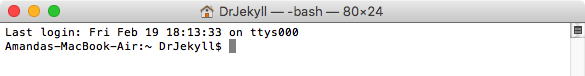

When asked to open a command line window and enter commands in this lesson, keep the following in mind:

1. **Commands that you should type (or copy/paste) into the command line are formatted like this:** `example of code formatting`. Each formatted chunk of code should be copied and pasted into the command line, followed by pressing enter. 

2. **Let installation processes run *completely* before entering new commands.** Sometimes typing a command and pressing enter produces an instantaneous result; sometimes lots of text will start to fill up the command line window, or the command line window will seem to not be doing anything (but something is actually happening behind the scenes, like downloading a file). **When you've typed a command and hit enter, you'll need to wait for that command to completely finish before typing *anything else***, or you might stop a process in the middle, causing problems. 
   {0}. You'll know your command has completed when the command line spits out the prompt again (e.g. *Macbook-Air:~ DrJekyll$* on the author's computer). See the screenshot below for an example of inputting a command, followed by some text showing you what was happening while that command was processed (and sometimes asking you to do something, like enter your password), and finally the reappearance of the command prompt to let you know it's okay to type something else. 

        
   {0}. If you need to do something else at the command line and don't want to wait, just open a separate command line window (hit command-N or go to *Shell > New Window > New Window with Settings-Basic*) and do things there while waiting for the process in the other command line window to finish.

3. Typing or pasting in the same commands a lot, or want to remember something you typed earlier? You can type the **↑** (up arrow) at the command line to scroll through recently typed commands; just press enter after the one you want to use appears.

## Installing dependencies <a id="section2"></a>

*We'll start by installing some software dependencies (i.e. code Jekyll depends on to be able to work) using the command line. Open a command line window (on Macs, Applications > Utilities > Terminal) and enter the code shown below (*`code is formatted like this`*), keeping [the command line tips from above](#section1-4) in mind.*

### Xcode <a id="section2-1"></a>

You'll need to first install the Mac developer toolkit Xcode to be able to use Homebrew. Homebrew lets you download and install open-source software on Macs from the command line (it's a "package manager"), which will make installing Ruby (the language Jekyll is built on) easier.

`xcode-select --install`

 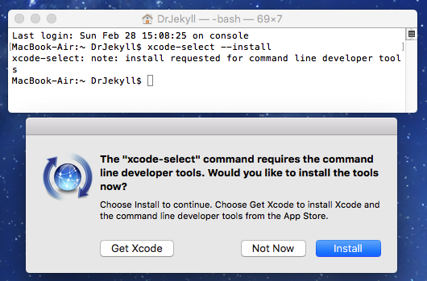

Entering this command produce a popup:

 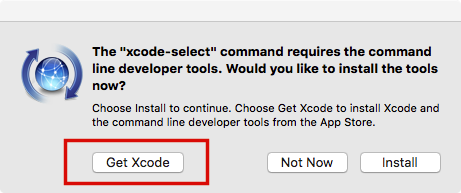

Click the "Get Xcode" button (***not*** the "Install" button, which won't install both things you need). This will open the App Store, where you should click on the "Get" button, then the "Install App" button that will appear where you just clicked, and enter your Apple username and password when prompted. The button's text will change a third time to say "Installing".


**Installation might take 3-5 hours** (the file size is around 4.5 GBs); you can check the download status by clicking on the "Purchased" icon in the App Store menu and finding Xcode on that page.

Once the software has completely downloaded, double-click on Applications > Xcode. You'll see a popup titled "Xcode and iOS SDK License Agreement" that you should agree to; provide your computer password if prompted. You'll then see a popup with a progress bar titled "Installing components"; wait for this to complete and for a new screen titled "Welcome to Xcode" to appear. You can now quit the Xcode program.

### Homebrew <a id="section2-2"></a>

After Xcode has completed installation, return to your command line window and enter the following:

``` 
/usr/bin/ruby -e "$(curl -fsSL https://raw.githubusercontent.com/Homebrew/install/master/install)"
```

You'll need to press enter when prompted and enter your computer password when asked. For reference, below is a screenshot of the command entered into the author's command line, followed by all the text that appeared (including the prompt to press enter, and to enter my password).


### Ruby & Ruby Gems <a id="section2-3"></a>

Jekyll is built from the Ruby coding language. Ruby Gems makes setting up Ruby software like Jekyll easy (it's a package manager, just like Homebrew—instead of making installation easy on Macs, it adds some stuff to make Ruby installations simpler).

`brew install ruby` 

Don't forget to wait until the command prompt appears again to type the following command:

`gem install rubygems-update`

### NodeJS <a id="section2-4"></a>

NodeJS (or Node.js) is a development platform (in particular, a "runtime environment") that does things like making Javascript run faster.

`brew install node`

### Jekyll <a id="section2-5"></a>

Jekyll is the code that handles doing the things you might want your website to do, such as using the same template (logo, menu, author information…) on all blog post pages.

`gem install jekyll`

## Setting up Jekyll <a id="section3"></a>

*We'll now create a folder full of the files needed to run your website, locating them in a place accessible to the GitHub Desktop app so they're ready when we want to publish them as a public website.*

1. You'll need to know the file path to the GitHub folder created by installing the GitHub Desktop app (this is some text that says where a specific folder or file is within the directory tree on your computer, e.g. /Desktop/MyRecipes/Spaghetti.doc). If you don't know the GitHub folder file path, click on the magnifying glass icon in the top right of your computer screen.

   

   A search box will appear in the middle of the screen; type in "GitHub", then double-click on the "GitHub" option that appears under "Folders" to reveal the GitHub folder in Finder.

   

   Right-click on the "GitHub" folder and choose "Copy 'GitHub'". The GitHub folder file path is now copied to your clipboard.

2. At the command line, write `cd`, followed by a space, followed by the file path to your GitHub folder (either type it in if known, or press Command-v to paste in the file path you copied in the previous step). On the author's computer (logged in as the user *DrJekyll*) this command looks like:

   

   The *cd* command (**c**hange **d**irectory) tells your computer to look at the place in the computer's folder system you specify by the path typed after it—in this case, the path to the GitHub folder created by installing the GitHub Desktop app.

3. Your site's public URL will take the form http://amandavisconti.github.io/JekyllDemo/, with *amandavisconti* being the author's GitHub username and *JekyllDemo* the name of the site I entered at this step (*an option to purchase and use your own [custom URL](#section7-2) is possible, but not covered in this lesson*). **Lowercase and uppercase website names do *not* point to the same website automatically**, so unlike my *JekyllDemo* example you might wish to pick an all-lowercase name to make sure people who hear about the site tend to type its URL correctly.

   At the command line, type in the following (but replace *JekyllDemo* with whatever you want your site to be called):

   `jekyll new JekyllDemo`

   This command told *jekyll* to create a *new* site by installing all the necessary files in a folder named *JekyllDemo*. **The folder you create at this step (e.g. *JekyllDemo*) will be referred to as the "website folder" for the rest of this tutorial.**

4. At the command line, type in the following to navigate into your site folder (through the rest of this lesson, always replace *JekyllDemo* with whatever name you chose for your site in the previous step):

   `cd JekyllDemo` (Don't forget to substitute the name of your website folder for *JekyllDemo* here!) 

   

   If you look in the GitHub > JekyllDemo folder in Finder, you'll see that a bunch of new files—the files that will run your website!—have been installed:

   

5. At the command line, type

   `gem install bundler` 

   `bundle init`

   Bundler is a Ruby Gem that will make testing your site easier; it needs to be installed directly into the website folder we just created (JekyllDemo), which is why we didn't install it earlier in this lesson. A new file named "Gemfile" will appear in your website folder.

6. Navigate to your website folder in Finder and open the "Gemfile" file. 

   You'll want to open this and any future website files using your [text editor](#section1-3) (e.g. TextWrangler). To force a file to open with your text editor, right-click on the file, then chose "Open with" and select the text editor program (you may need to choose "Other…" to find the text editor if it isn't in the list that appears).

   

7. Add the two following lines of text, on separate lines and with the same lower-case formatting, as shown in the screenshot below, then save:

   ```
   gem 'jekyll'
   gem 'github-pages'
   ```

   

8. At the command line, type

   `bundle install`

   This will install the *jekyll* and *github-pages* gems you just listed in the Gemfile. (Don't forget to let the entire process finish and the prompt reappear before typing any more commands! This process will take a few minutes, as a number of dependencies are being installed.)

9. At the command line, type

   `bundle exec jekyll serve --watch`

   This is the command you'll run whenever you want to view your website locally.

   *jekyll serve* tells your computer to run Jekyll *locally*—meaning you'll be able to see what your website will look like in a web browser on your computer, but not anywhere else. Doing something locally means that no one else can see your website yet (your website isn't "live" or "public": no one can type in the URL and see it in their browser). This means you can experiment all you want, and only publish your site  for the world to see when it's ready (or once it's ready, experiment locally with new writing, design, etc. and only add these to the public site once you're happy with them!).

   *--watch* together with *bundle exec* tells Jekyll to watch for changes to the website's files, such as you writing and saving a new blog post, and to include these changes on refreshing your web browser. **An exception to this** is the _config.yml file, which I'll discuss in more detail in the next section (any changes there won't show up until you stop and restart the jekyll process).

10. After typing in the command in the previous step, you'll notice that the process never finishes. Remember how I said on the command line, if you type in anything while the previous command is still processing, you can cause problems? Well, Jekyll is now being run from this command line window, so you'll need to open a new command line window if you want to type other commands while your local site is still accessible (see [the section on command line usage above](#section1-4).)

    

    Reports and error messages caused by changes you make to the files in the website folder will appear in this command line window, and are a good first place to check if something isn't working (e.g. if you let the site run locally long enough at this step, you'll get an error message that the site can't find a favicon image for the site).

    To stop running the site locally, press **control-c** (this frees up the command line window for use again). 

11. View your site (locally only—i.e. just on the computer you're working on) by visiting **localhost:4000**. You'll see your basic Jekyll website:

    

### Mini cheatsheet <a id="section3-1"></a>

- Type `bundle exec jekyll serve --watch` at the command line to start running your website locally. You'd visit **localhost:4000** in a browser to see your local site now, but in the next section we'll be changing things such that you'll need to visit **localhost:4000/JekyllDemo/** to see the site from then on (filling in your website folder name for *JekyllDemo*, and making sure to include the last slash).

- Type control-c at the command line to stop running the website locally.

- While the site is running, after making changes to website files: save the files and refresh the webpage to see the changes—**except for the _config.yml file**, for which you must stop running the website and restart running the website to see changes.

- Typing or pasting in `bundle exec jekyll serve --watch` a lot? Instead, you can type the ↑ (up arrow) at the command line to scroll through recently typed commands; just press enter after the command you want to use appears.

## Tweaking the settings <a id="section4"></a>

### Basic site settings via _Config.yml <a id="section4-1"></a>

*Let's start customizing all that boilerplate text!*

1. Navigate to your website folder in Finder (the author's is at /Users/DrJekyll/JekyllDemo (*DrJekyll* is my logged in username, and *JekyllDemo* is the name of my website folder); [return to the "Setting up jekyll" section](#section3) if you need help locating your website folder).

   

2. We'll start by customizing the main settings file, **_config.yml**. You'll want to open this and any future website files using your text editor (e.g. TextWrangler).

   

   

3. You can change the text in this file, save the file, and then visit your local website in a browser to see the changes. **Note that changes to _config.yml**, unlike the rest of your website files, will not show up if made while the website is already running; you need to make them while the website isn't running, *or* after making changes to _config.yml stop then start running the website, to see changes made to this particular file. (*Changes to the _config.yml file were left out of the ability to refresh because this file can be used to declare things like the structure of site links, and altering these while the site is running could badly break things.*)

   Making small changes to website files (one at a time to start with), saving, and then refreshing to see the effect on your site means if you mess anything up it will be clear what caused the issue and how to undo it.

   1. Note that any line that starts with a # sign is a *comment*: comments aren't read when the rest of the code is read, and instead serve as a way to leave notes about how to do something or why you made a change to the code. 
   2. Comments can always be deleted without effect to your website (e.g. you can delete the commented lines 1-6 in _config.yml if you don't want to always see this info about Jekyll use).

4. Change the file according to these instructions:

   - **title**: The title of your website, as you want it to appear in the header of the webpage.
   - **email**: Your email address.
   - **description**: A description of your website that will be used in search engine results and the site's RSS feed.
   - **baseurl**: Fill in the quotation marks with a forward slash followed by the name of your website folder (e.g. "/JekyllDemo").
   - **url**: Replace "http://yourdomain.com" with "localhost:4000"
   - **twitter_username**: Your Twitter username (do not include @ symbol).
   - **github_username**: Your GitHub username.

   The changes you made to the *baseurl* and *url* lines will let your site run from the same files both locally on your computer and live on the Web, but **doing this changed the URL where you'll see your local site from now on** (while [Jekyll is running](#section3-1)) from localhost:4000 to **localhost:4000/JekyllDemo/** (substituting your website folder name for *JekyllDemo* and remembering the last slash mark).

   In the screenshot below, I have deleted the initial commented lines 1-6 as well as the commented text stating what "description" does (not necessary, just to show you can delete comments that you don't care about seeing!):

   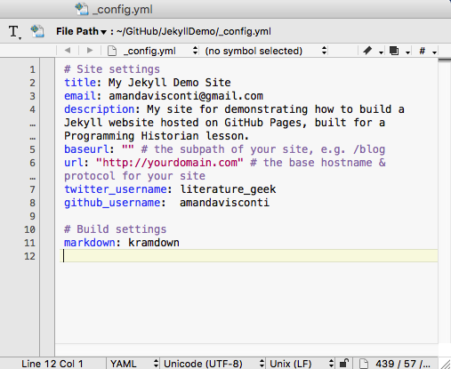

5. Save the file, and start (or stop and restart) the website, then visit **localhost:4000/JekyllDemo/** (substituting your website folder name for *JekyllDemo* and remembering the last slash mark) to see your customized local site:

   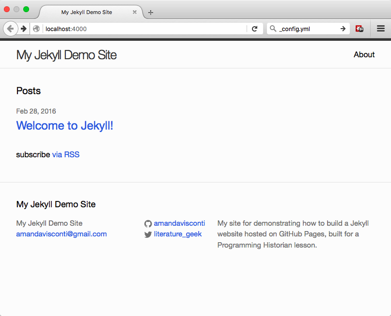

### Where (and what) is everything? <a id="section4-2"></a>

To get a sense of how your site works and what files you'd experiment with to do more advanced things, here are some notes on what each thing in your current website folder does. Remember to always open and edit any files with your text editor (e.g. TextWrangler) and not a word processor (e.g. not Microsoft Word or anything that lets you add formatting like italic and bold), to prevent invisible formatting characters from being saved in the file and messing up the website. If you just want to start adding content to your site and make it public, skip to the next section.


- **_config.yml** is covered in the subsection above; it provides basic setting information about your site, such as the site's title and additional possibilities like how to structure links to posts (e.g. should they follow the pattern MySite.com/year/month/day/post-title?).
- **_includes** folder has files that get included on all or certain pages (e.g. code to make the header contain your site title and main menu on every page of the site)
- **_layouts** folder contains code that controls how the pages on your site look (default.html), as well as customizations of that code to further style blog posts (post.html) and pages like the About page (page.html)
- **_posts** folder holds the individual files that each represent a blog post on your website. Adding a new post to this folder will make a new blog post appear on your website, in reverse chronological order (newest post to oldest). We'll cover adding blog posts in the next section.
- **_sass** folder holds SCSS files that control the visual design of the site
- **_site** folder is where the HTML pages that appear on the web are generated and stored (e.g. you'll write and save posts as Markdown files, but Jekyll will convert these to HTML for display in a web browser)
- **about.md** is an example of a Jekyll *page*. It's already linked in the header of your website, and you can customize its text by opening and writing in that file. We'll cover adding more site pages in the next section.
- **css** folder holds CSS converted from SCSS
- **feed.xml** lets people follow the RSS feed of your blog posts.
- **index.html** controls content on your sites homepage.

## Writing pages and posts <a id="section5"></a>

*Some information on what you'll be using (Markdown) to write blog posts and pages on your website, followed by instructions on writing your first post and page.*

**Posts** *and* **pages** *are just content that's styled differently; posts is meant to be used for content organized by publication date, while pages are content like an About page that isn't organized or displayed chronologically, but might be included in your website's main menu. The URLs for posts and page are also different by default (although you can change this): page URLs look like MySite.com/about, while post URLs look like MySite.com/2016/02/29/my-post-title.*

#### Authoring in Markdown <a id="section5-1"></a>

Markdown is a way of formatting documents. For Jekyll in particular, Markdown means you can write webpages and blog posts in a way that's comfortable to authors (e.g. no need to look up/add in HTML tags while trying to write an essay), but have that writing show up formatted nicely on the web (i.e. a text-to-HTML convertor).

We won't cover Markdown in this lesson; if you're not familiar with it, for now you can just create posts and pages with no formatting (i.e. no bold/italic, no headers, no bulleted lists). But these are easy to learn how to add: there's a handy markdown [reference](http://kramdown.gettalong.org/quickref.html), as well as [a Programming Historian lesson on the hows and whys of writing with Markdown](http://programminghistorian.org/lessons/getting-started-with-markdown). You might be interested in "markdown editor" software such as [Typora](http://www.typora.io/) (OS X and Windows; free during current beta period), which will let you use popular keyboard shortcuts to write Markdown (e.g. highlight text and press command-B to make it bold) and/or type in Markdown but have it show as it will look on the web (see headings styled like headings, instead of like normal text with a # in front of them).

Make sure any Markdown cheatsheets you look at are for the "[kramdown](http://kramdown.gettalong.org/quickref.html)" flavor of Markdown, which is what GitHub Pages (where we'll be hosting our website) supports. (*There are [various "flavors" of Markdown](https://github.com/jgm/CommonMark/wiki/Markdown-Flavors) that have subtle differences in what various symbols do, but for the most part frequently used symbols like those that create heading formatting are the same—so you're actually probably okay using a markdown cheatsheet that doesn't specify it's kramdown, but if you're getting errors on your site using symbols that aren't included in kramdown might be why*).

### Authoring posts <a id="section5-2"></a>

1. In Finder, navigate to your website folder (e.g. JekyllDemo) and the *_posts* folder inside it. Open the file inside it with either a text editor (e.g. TextWrangler) or a Markdown editor (e.g. Typora). The file will be named something like 2016-02-28-welcome-to-jekyll.markdown, but the date will match when you created the Jekyll site.

   

   The stuff between the \--- lines is called "front matter". It tells your site whether to format the content below the front matter as a page or blog post, the title of the post, the date and time the post should show it was published, and any categories you'd like the post or page listed under.

2. We're going to write a second post so you can see how multiple posts look on your site. Close the 20xx-xx-xx-welcome-to-jekyll.markdown file that was open, then right-click on that file in Finder and choose "Duplicate". A second file named 20xx-xx-xx-welcome-to-jekyll copy.markdown will appear in the _sites folder.

3. Click once on the 20xx-xx-xx-welcome-to-jekyll copy.markdown file name so that you can edit the file name, then alter it to show today's date and contain a different title, such as 2016-02-29-a-post-about-my-research.markdown (use hyphens between words, not spaces).

4. Now open your renamed file in TextWrangler, and customize the following:

   - **layout:** Keep this as is (it should say *post*).
   - **title:** Change "Welcome to Jekyll!" to whatever title you'd like (keep the quotation marks around the title). It's the norm to make the title the same as the words in the filename (except with spaces and capitalization; this is how the title will appear on the post's webpage).
   - **date:** Change this to when you want the post to show as its publication date and time, making sure to match the date that's part of the filename. (The date *and* time should have occurred already, for your post to show up.)
   - **categories:** Delete the words "jekyll update" for now, and don't add anything else here—the current theme doesn't use these and they mess up the post URLs. (Other themes can use this field to sort posts by categories.)
   - **The space below the second \---:** This is where you write your blog post, using [the Markdown formatting described above](#section5-1).

   You should now be able to see your second post on the front page of your site, and clicking on the link should take you to the post's page:

   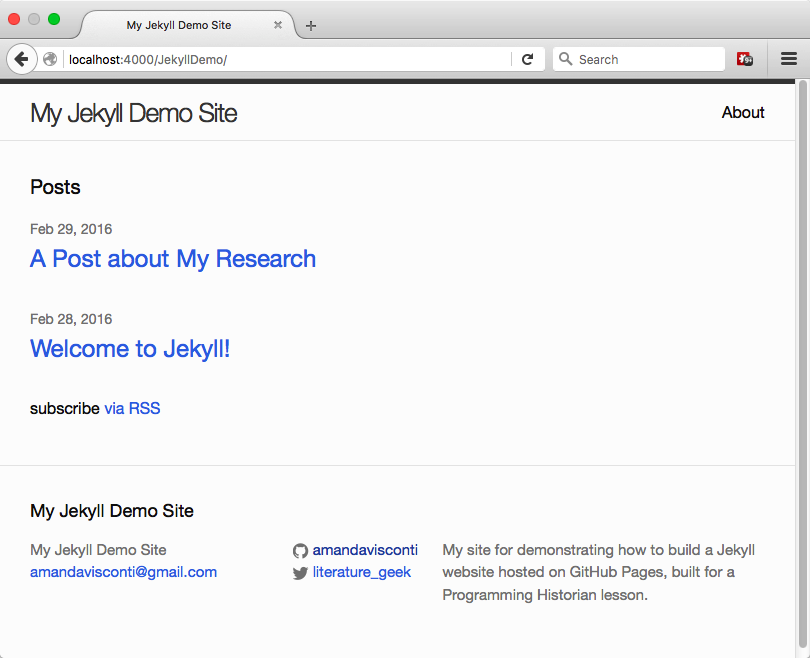

   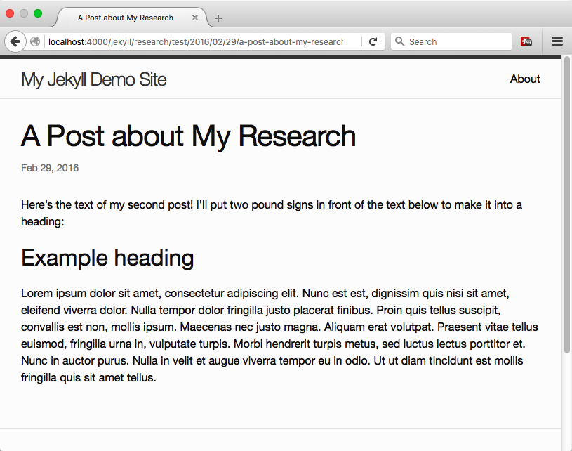

Notice that **the URL of the post** is your local website URL (e.g. localhost:4000/JekyllDemo/) followed by the year/month/date of publication, followed by the title as written in your filename and .html (e.g. *localhost:4000/JekyllDemo/2016/02/29/a-post-about-my-research.html*). Jekyll is converting the Markdown file you authored in the _posts folder into this HTML webpage.

**Deleting a file** from the _posts folder removes it from your website (you can try this with the "Welcome to Jekyll!!" sample post).

**To create further posts**, duplicate an existing file, then remember to change not just the front matter and content inside the post as described above, but also the file name of the new file.

For reference, you can check out [an example of a post](http://amandavisconti.github.io/JekyllDemo/2016/02/29/a-post-about-my-research.html) on my demo site, or see [the code running that post](http://raw.githubusercontent.com/amandavisconti/JekyllDemo/gh-pages/_posts/2016-02-29-a-post-about-my-research.markdown).

### Authoring pages <a id="section5-3"></a>

1. To see an existing page, navigate to your website folder and open the **about.md** file either in a text editor (e.g. TextWrangler) or a Markdown editor (e.g. Typora). Also click on the "about" link in the top-right of your webpage to see what the file looks like on the web.

2. As with posts, you can change things in the front matter:

   - **layout:** Keep this as is (it should say page).
   - **title:** Change this to the desired page title (unlike posts, no quotation marks around the title).
   - **permalink:** change the text between the two forward slash marks to the word (or phrase—but you'll need to use hyphens and not spaces!) that you want to follow your site's main URL to reach the page. For example, **permalink: /about/** locates a page at **localhost:4000/yourwebsitefoldername/about/**

3. Also as with posts, author the content of the page in Markdown below the second \--- of the front matter.

4. To create a new page in addition to the About page that already exists (and can be customized or deleted), create a copy of the about.md file in the same folder (the main website folder) and change its filename to the title you wish (e.g. resume.md). Also change the title and permalink in the file's front matter, and the content of the file. The new page should automatically appear in the main menu in the site's header:

   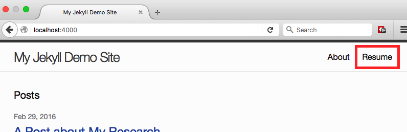

## Hosting on GitHub Pages <a id="section6"></a>

*We'll now move your local site live so that others can visit it on the Web.* **Note that we are making your site publicly viewable at this point.**
1. Open the GitHub Desktop app. Click the + icon in the top left corner, and click on the "Add" option along the top of the box that appears (if "Add" isn't already selected").

2. Click on the "Choose…" button and choose the folder containing your website files (JekyllDemo in my example). Then, click on the "Create & Add Repository" button. You'll now see a list of the files to which you've made changes (additions or deletions to and of files); since this is the first time we're moving our code from our computer to GitHub, you'll see a list of all your website's files (since compared to zero files they're all new).
3. Type a short (space is limited) description of the changes you've made since you last moved your work on the website to GitHub. In this first case, something along the lines of "first commit" is fine; in the future, you might want to be more descriptive to help you locate when you made a given change—e.g. writing "Added new 'Contact Me' page".

   You can use the larger text area below this to write a longer message, if needed (it's optional).

   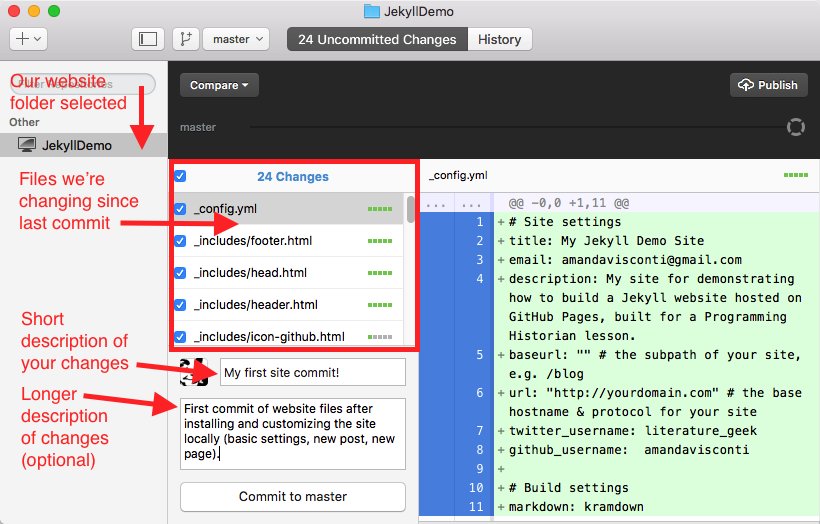
4. At the top of the app window, click on the third icon from the left (it will say "Add a branch" if you hover over it). Type *gh-pages* in the "Name" field, then click the "Create branch" button.

   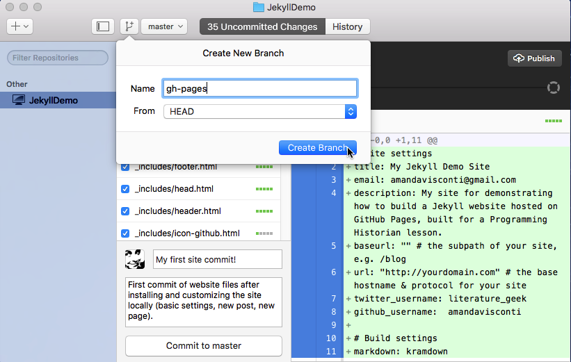

5. Click on the "Commit to gh-pages" button near the bottom-left of the app window.

   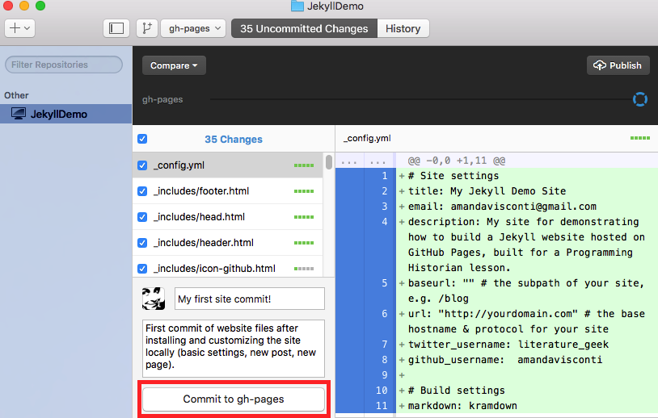
6. Click on the "Publish" button in the top-right.

   
7. In the popup, leave everything as-is and click the "Publish repository" button in the lower-right (your window may not show the options related to private repositories shown in the screenshot).

   
8. Click the "Sync" button in the upper-right

   
9. You can now visit (and share the link to!) your live website. The URL will follow the pattern of your GitHub username DOT github.io SLASH name of your website. (For example, the author's URL is amandavisconti.github.io/JekyllDemo.)

### Mini cheatsheet <a id="section6-1"></a>

In the future when you want to move changes to your live site, follow just these steps:

1. Open the GitHub Desktop app and type a short description of your changes (and optionally a longer description in the second text box).
2. Click the "commit" button underneath the text box.
3. Once the commit has finished, click the "Sync" button in the top-right.
4. Give GitHub a little time to receive these changes (about 10-60 seconds) before refreshing your live site to see your changes there.

## Getting fancy <a id="section7"></a>

This lesson won't cover advanced work like changing the visual appearance of your site or adding new functionality, but here is some information to get you started on your own. 

### Visual design <a id="section7-1"></a>

The visual design of a website is often referred to as its theme (more properly, a theme is a set of code and image files that together make a major change to the appearance of a website). 

You can customize the current (aka "default") theme of the website by making changes to the files in the _sass and css folders (unfortunately, the most recent version of Jekyll's move to use SASS instead of plain CSS makes learning to customize things a bit more difficult for non-designers, but not overly so).

Or, you can add in (and further customize, if desired) a theme already created by someone else by searching for "Jekyll themes" or trying one of these resources

- Alex Gil's "Ed" theme for minimal digital editions (https://elotroalex.github.io/ed/, https://elotroalex.github.io/ed/documentation.html; free)
- Rebecca Sutton Koeser's Digital Edition theme (https://github.com/emory-libraries-ecds/digitaledition-jekylltheme; free)
- The [Jekyll Themes](http://jekyllthemes.org/) directory (free)
- [JekyllThemes.io](http://jekyllthemes.io/) (free and paid)

### Functionality <a id="section7-2"></a>

- [Jekyll plugins](http://jekyllrb.com/docs/plugins/) allow you to add small bits of code that add functionality to your site such as [full-text search](https://github.com/PascalW/jekyll_indextank), [emoji support](https://github.com/yihangho/emoji-for-jekyll), and [tag clouds](https://gist.github.com/ilkka/710577). 

  - If you want to host your site on GitHub Pages as we did in this lesson, you can only use the Jekyll plugins already included in the GitHub Pages gem we installed (here's [a full list of what you installed](https://pages.github.com/versions/) when adding the GitHub Pages gem to your Gemfile earlier).

  - If you choose to host your Jekyll website elsewhere than GitHub Pages, you can use any Jekyll plugin (instructions to self-host vary by web host and won't be covered here, but [this](http://jekyllrb.com/docs/plugins/) is a page about how to install plugins once you've set up your self-hosted Jekyll site). You can search for "Jekyll plugin" plus the functionality you need to see if one is available, or check out the "Available plugins" section near the bottom of [this page](http://jekyllrb.com/docs/plugins/) for a list of plugins.
- You can keep GitHub Page's free hosting of your Jekyll website, but give the site a **custom domain name** (domain names are purchased for a reasonable yearly fee—usually around $10—from a "domain name registrar" such as [NearlyFreeSpeech.net](https://www.nearlyfreespeech.net/services/domains)). For example, the author's LiteratureGeek.com blog is built with Jekyll and hosted on GitHub Pages just like the site you built with this lesson, but it uses a custom domain name I purchased and configured to point to my site. Instructions on setting up a custom domain name can be found [here](https://help.github.com/articles/using-a-custom-domain-with-github-pages/).

- You can migrate an existing blog from many other systems including WordPress, Blogger, Drupal, and Tumblr by following the links on the right side of [this page](https://import.jekyllrb.com/docs/home/). When migrating a site, make sure to back up your original site in case it takes a couple tries to get posts living at the same URL as before (so search engine results and bookmarks don't break).

## Cheatsheet <a id="section8"></a>

To test stuff (new plugin, theme, how a new blog post looks) locally:
- *Start local site*: Type `bundle exec jekyll serve --watch` at the command line
- *Visit local site*: Open **localhost:4000/yourwebfoldername/** in a web browser (e.g. localhost:4000/JekyllDemo/). Don't forget the trailing slash!site
- *See changes on the local site as you make them:* While the site is running, after making changes to website files: save the files and refresh the webpage to see the changes—**except for the _config.yml file**, for which you must stop running the website and restart running the website to see changes.
- *Stop local site:* Type control-c at the command line

To move local changes (new post, settings tweak, etc.) to your live site:
- Make the desired changes to your website's local files.
- Open the GitHub Desktop app, make sure your website is chosen in the left sidebar's list of repositories, and write your commit message summary (and description if desired).
- Click "Commit to gh-pages" in the lower left.
- After the commit has completed, click "Sync" in the upper right.
- Allow up to a minute for your changes to reach GitHub's web servers, then visit your website and refresh the page to see your changes live!

## Help, credits, & further reading <a id="section9"></a>

### Need help? <a id="section9-1"></a>

Run into a problem while using this lesson, or found something that should be written more clearly? You can ask questions or submit suggested additions/edits to this lesson in two ways:

1. [Annotating with Hypothesis Via by visiting http://via.hypothes.is/amandavisconti.github.io/ph-submissions/lessons/building-static-sites-with-jekyll-github-pages](http://via.hypothes.is/amandavisconti.github.io/ph-submissions/lessons/building-static-sites-with-jekyll-github-pages)
2. Add comments to the submission ticket for this lesson at [Forthcoming link to lesson submission ticket]

If you review the lesson and make suggestions (or report successful lesson use), we'd like to credit you by name as one of the lesson's reviewers.

### Credits <a id="section9-2"></a>

Thanks to Programming Historian Editor Fred Gibbs for editing and discussing this lesson, and Tod Robbins and Matthew Lincoln for suggestions on the [DH Slack](http://tinyurl.com/DHSlack) as to what to cover in this lesson.

### Further reading <a id="section9-3"></a>

Check out the following links for documentation, inspiration, and further reading about Jekyll:

* [Official Jekyll Documentation](http://jekyllrb.com/docs/home/)
* https://help.github.com/articles/using-jekyll-with-pages/
* Amanda Visconti, ["Introducing Static Sites for Digital Humanities Projects (why & what are Jekyll, GitHub, etc.?)"](http://literaturegeek.com/2015-12-08-WhyJekyllGitHub/)
* Alex Gil, ["How (and Why) to Generate a Static Website Using Jekyll, Part 1"](http://chronicle.com/blogs/profhacker/jekyll1/60913)
* Eduardo Bouças, ["An Introduction to Static Site Generators"](https://davidwalsh.name/introduction-static-site-generators)
* http://ben.balter.com/jekyll-style-guide/
* The [Prose](http://prose.io/) content editor (built on Jekyll)