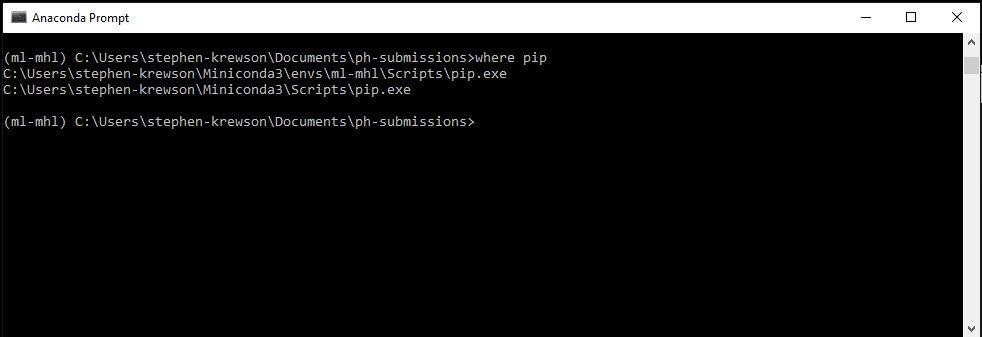
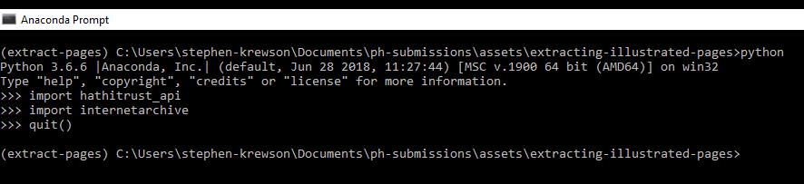

# Contents




# Introduction

What if you only wanted to look at the pictures in a book? This is a thought that has occurred to young children and adult researchers alike. If you knew that the book had been digitized and was available through a digital library, it would be nice to download only those pages with pictures and ignore the rest.

This lesson is intended for those whose research or interest has led them to look at public-domain digitized books on HathiTrust (HT) or Internet Archive (IA), two of the largest digital libraries in the world. Specifically, the lesson will equip users who want to know more about visual layout (*mise en page*) and illustration. 

For instance, my own research is on changes in the frequency and type of pictures in early nineteenth-century children's books. This means I count how many pictures per book and try to estimate what printing process was used to make them (relief, intaglio, lithographic, etc.). Another use case might be comparing changes in illustration among [different editions](https://www.cambridge.org/core/books/cambridge-companion-to-robinson-crusoe/iconic-crusoe-illustrations-and-images-of-robinson-crusoe/B83352C33FB1A9929A856FFA8E2D0CD0/core-reader) of the same book. There are countless further research questions concerning the characteristics of the extracted pictures: color, size, theme, number of figures, etc.

Note that this lesson is only applicable to resources in HT or IA that are composed of *pages*. For instance, these techniques will work with records that are books or periodicals but not videos. In a subsequent lesson, I will discuss how to get *localized* information about visual regions of interest. This is a technical way of saying that the current lesson answers the yes/no question "are there picture(s) somewhere on this page?" while the next lesson will use machine learning to filter out false positives and answer the question "what are the coordinates of the proposed images on the page?"

# Goals

By the end of the lesson you will be able to

- Set up the "minimal" Anaconda Python distribution (Miniconda) and create an environment
- Save and iterate over a list of HT or IA volumes ids generated by a search
- Access the HT and IA data APIs through Python libraries
- Find page-level visual features
- Download page JPEGs programmatically (with the `requests` library)

The larger goal is to improve your data science skills by creating a historical image dataset and using metadata to formulate research questions about visual change over time.


# Software Requirements

This lesson's software requirements are minimal, other than having a machine that runs a relatively recent edition of the standard operating systems. Miniconda is available in both 32- and 64-bit versions for Windows, macOS (previously Mac OS X), and Linux.

Python 3 is the current stable release of the language and will be supported indefinitely.

When it comes to sustainability, the greater danger is from non-backwards compatible API changes. For instance, the API endpoint used to download a page from a HathiTrust resource might change in name or number of parameters or in its return value. This may cause a cascade of errors in our code since the Python libraries we use to make requests to these API endpoints will need to be updated, and their corresponding functions adjusted. How and when this happens may be outside your control. It's a good idea to get practice with opening a GitHub issue, since both the libraries we will be using have public repositories. GitHub can be an excellent place to find solutions to similar problems that other users are encountering.

It's also possible that an organization may stop providing API access altogether, but the chances of this happening with HathiTrust and Internet Archive, two major organizations, is slim.

In any case, if you run into problems with API wrapper functions, it's a good idea to check if the API or the wrapper library has updated or been disabled in some way. Here are the current versions (if available) at the time of the last update of this lesson.

For Python packages, you can check the `version` field in the project's `setup.py` file in the top-level directory. Many projects practice "semantic versioning," about which you can read more [here](https://semver.org/). 

- HathiTrust Data API ([Version 2](https://www.hathitrust.org/data_api))
- Robert Marchman's `hathitrust-api` Python package ([Version 0.1.1](https://github.com/rlmv/hathitrust-api/blob/master/setup.py)) [third-party]
- Internet Archive Python Library ([no version listed](https://github.com/jjjake/internetarchive)) [maintained by IA employee Jake Johnson and likely wrapping the [Version 1 Search API](https://archive.org/services/search/beta/)


# Suggested Prior Experience

You need to know the basics of how to use the command line and Python. You should understand the conventions for comments and commands in a command line tutorial. 

```bash
# this is an example command--don't actually run it!
source activate base

# On Windows, this command would be slightly different:
conda activate base
```

The hash marks indicate a comment. The command itself will be in color (this is called syntax highlighting). If the command is slightly different on a different OS, I will try to put the alternate version in a comment.

In teaching Unix, it's often the "paratextual" UI aspects (rather than the commands themselves) that confuse learners. A simple example: you need to be familiar with typing `y`/`n` or `yes`/`no` when asked by a script whether you want to proceed or not. For instance, `conda` will always ask you if you are OK with the memory or version requirements of an installation or update.

I recommend the following [PH lesson](https://programminghistorian.org/en/lessons/intro-to-bash) for learning or brushing up on your command line skills.


# Comparison to Similar PH Lessons

*Programming Historian* (PH) features several lessons on working with large-scale text collections from digital libraries. The most relevant is Peter Organisciak and Boris Capitanu's ["Text Mining in Python through the HTRC Feature Reader."](https://programminghistorian.org/en/lessons/text-mining-with-extracted-features) Please consult the introductory sections of that lesson for an excellent summary of the HathiTrust Research Center (HTRC)--its scope, mission, and efforts to provide researchers access to in-copyright works. Roughly speaking, this lesson is different because it is aimed at acquiring *visual* information about the page layout. These *visual features* are precisely what is blocked or limited by copyright agreements. Think of the way that Google Books allows full-text searching, but can only show "snippets" of the results. The textual features that Peter and Boris discuss are essentially just counts of words and punctuation (generated from the existing OCR text) for each of the several billion pages in HT, regardless of copyright.

Sticking with the public domain allows us to access the OCR text in order (not just aggregated word counts) as well as estimate the visual components of a given page and download it if desired. Since I will be using a similar Python environment and data pipeline to that presented by Peter and Boris, I have made a chart of key similarities and differences.


| Feature/PH Lesson | HTRC Extracted Features | HT, IA Visual Features (this lesson) |
|-------------------------|-------------------------|------------------------------------------------------------|
| Development Environment | Python 3 (Anaconda) | Python 3 (Anaconda) |
| Data Exploration | Jupyter Notebooks | Jupyter Notebooks |
| Data Analysis | Pandas | Pandas |
| APIs | HTRC Feature Reader  | HT Data API (third-party), Internet Archive Python Library |
| Page Downloads | None | Full-page JPEGs |


# How Are Visual Features Obtained?

HathiTrust and Internet Archive use different sources when associating visual/bibliographic features with pages. They then store the resulting information in different formats. The best way to explain this is to show it concretely.

HathiTrust makes a field called `htd:pfeat` available for many of its public-domain texts. This field's type is `list` and it exists within a Python object that is associated with each volume. In a subsequent section, we will see how to access this object and its fields using the HT Data API. The semantics of the `htd:pfeat` name is as follows: `htd` stands for "HathiTrust Data [API]" and `pfeat` stands for "page-level feature." Year of publication, by contrast, is a volume-level feature. The [most recent documentation](https://www.hathitrust.org/documents/hathitrust-data-api-v2_20150526.pdf) for the Data API describes `htd:pfeat` on pages 9-10, within a section on "Extension Elements" for the Data API.


> * `htd:pfeat`­ - the page feature key (if available):
>    - CHAPTER_START
>    - COPYRIGHT
>    - FIRST_CONTENT_CHAPTER_START
>    - FRONT_COVER
>    - INDEX
>    - REFERENCES
>    - TABLE_OF_CONTENTS
>    - TITLE


In practice, there a quite a few more features that regularly appear. The one we will be working with is called IMAGE_ON_PAGE and it is more visual and less structural than those shown above. Note that the `htd:pfeat` array may either not exist or be empty for a given page. This makes it important to write Python code that is free of assumptions and handles the possibility of key errors (the error that happens when you try to access a non-existent field in an object or dictionary).

Tom Burton-West, a research librarian at the University of Michigan Library, works closely with HathiTrust and HTRC, HathiTrust's Research Center. Tom told me over email that HathiTrust is provided this information by Google, with whom they have worked closely since their (HT's) founding in 2008. A contact at Google gave Tom permission to share the following quote: 

> These tags are derived from a combination of heuristics, machine learning, and human tagging.

A planned future lesson on filtering out false positives for the IMAGE_ON_PAGE feature will be good opportunity to explain these three sources in more detail. Roughly speaking, an example heuristic might be that the first page in the volume page sequence is almost always the FRONT_COVER. Machine learning could be used to train models to discriminate, say, between image data that is more typical of lines of prose in a Western script or of the lines in an engraving. Human tagging is the manual assignment of labels to images. The ability to view a volume's illustrations in the EEBO and ECCO databases is an example of human tagging.

The use of "machine learning" by Google sounds somewhat mysterious. Until Google publicizes their methods, it is impossible to know the details. But reasonable inferences can be made about the amount of extra computing resources devoted to old public-domain book scans (probably very little!).

In all likelihood, the IMAGE_ON_PAGE features are generated by looking for "Picture" blocks in the OCR XML files. This is good segue to Internet Archive, which does not currently release any page-level features (whether textual or visual/structural). Instead, Internet Archive makes a number of raw files from the digitization process available to users. The most imporant of these for our purposes is the Abbyy XML file. Abbyy is a Russian company that dominates the market in optical character recognition software. I am compiling data on the version of Abbyy FineReader used in OCR-ing nineteenth century medical texts held in IA. The most popular versions are 8, 9, and 11. All recent versions of FineReader produce an [XML document](https://en.wikipedia.org/wiki/XML) that associates different "blocks" with each page in the scanned document. The most common type of block is `Text` but there are `Picture` blocks as well. Here is an example block taken from an IA Abbyy file. The top-left and bottom-right corners are enough to identify the rectangular block region, since it is oriented in the same direction as the page itself.


```xml
<block blockType="Picture" l="586" t="1428" r="768" b="1612">
<region><rect l="586" t="1428" r="768" b="1612"></rect></region>
</block>
```


The IA equivalent to looking for IMAGE_ON_PAGE is parsing the Abbyy XML file and iterating over each page. If there is at least one "Picture" block on that page, then that page is flagged as possibly containing an image. This heuristic method of image discovery was pioneered by [Kalev Leetaru](https://blog.gdeltproject.org/500-years-of-the-images-of-the-worlds-books-now-on-flickr/) in 2014. Between then and the time of writing (2018), speedups in Python's ability to parse large XML files and improvements to Internet Archive's API have made it possible to streamline Leetaru's implementation. While HT's IMAGE_ON_PAGE feature is binary and contains no information about the location of the image, the "Picture" blocks in the XML file are associated with a rectangular region on the page. However, since Abbyy FineReader specializes in recognizing letters from Western character sets, it is much less accurate when it comes to identifying image regions.

Part of the intellectual fun of this lesson is using a noisy dataset (OCR block tags) for a largely unintended purpose: identifying pictures and not words. At some point, it will become computationally feasible to run deep learning models on every raw page image in a volume and pick out the desired type(s) of picture(s). But since most pages in most volumes are uninillustrated, that is an expensive task. For now, it makes more sense to leverage the existing data we have from the OCR ingest process. 

For more information on how OCR itself works, please see [this lesson](https://programminghistorian.org/en/lessons/retired/OCR-with-Tesseract-and-ScanTailor) from PH. Although it is retired, the lesson helpfully shows the interaction between the scan process and the OCR process. Errors can crop up at many points, due to skewing, scan artefacts, and many other problems. This ends up affecting the accuracy of the "Picture" blocks. In many cases, Abbyy will estimate that blank or discolored pages are actually pictures. This is not correct, but it can be dealt with in the filtering step (discussed next lesson). Think of the page images downloaded in this lesson as a "first pass" in a longer process of obtaining a clean and usable dataset of historical illustrations.


# Setup

## Install Miniconda

Anaconda is the leading scientific Python distribution. Its `conda` tool allows you to install libraries such as `numpy` and `tensorflow` with ease. I recommend installing the "Miniconda" version, since it does not come with any packages preinstalled. This encourages you to keep your base environment clean and only install what you need, reducing complexity. Note that you do not need to have Python installed; Minicoda will provide it for you.

Download and install Miniconda [here](https://conda.io/miniconda.html). Choose the latest stable release of Python 3. Accept all the defaults during the installation unless you have a good reason to choose something different. There is no need to install Microsoft Visual Studio if asked. If everything goes well, you should be able to run `which conda` (linux/macOS) or `where conda` (Windows) in your shell and see the location of the program in the output.

Important! From now on, I will simply say "shell" independent of operating system. There is a chart at the end of this section that shows some of the key differences. Windows users: do NOT use `PowerShell` or `cmd.exe`; use the program `Anaconda Prompt`. It's a good idea to pin this program to your taskbar.

## OS Differences

Select differences between operating systems when using `conda`.


| Command/OS | Linux | macOS | Windows |
|----------------------|-------------------------|-------------------------|------------------------|
| Shell program | Terminal (bash) | Terminal.app (bash) | Anaconda Prompt |
| Change directories | `cd` | `cd` | `cd` |
| List directory contents | `ls` | `ls` | `dir` |
| Delete a resource | `rm` | `rm` | `del` |
| Clear the console | `clear` | `clear` | `cls` |
| File path slash | / | / | \ |
| Activate `conda` env | `source activate <ENV>` | `source activate <ENV>` | `conda activate <ENV>` |
| Return to `base` env | `source deactivate` | `source deactivate` | `deactivate` |

## Environments

In a newly opened shell, run the following commands one after the other. The motivation for this is understanding how environments help control the complexity associated with using the `conda` and `pip` package managers in tandem. Unfortunately, not all Python libraries can be installed through `conda`. This means in some cases we will fall back to the standard Python package manager, `pip`. However, when we do so, we will use a version of `pip` installed by `conda`. This keeps all the packages we need for the project in the same virtual sandbox.

```bash
# shows the system-wide Python packages (hopefully not too many!)
pip freeze

# the only environment here should be named "base"
# you current environment is indicated by a preceding asterisk
conda env list

# currently installed packages in "base" (will be minimal!)
conda list
```

Now we create an environment, set it to use Python 3, and activate it. A handy cheatsheet of `conda` commands is [here](https://conda.io/docs/_downloads/conda-cheatsheet.pdf). I recommend printing this out and keeping it by your workstation. Go slow, especially at first. Try to think about the rationale for a command before running it. If you are not sure, it's always a good idea to research further by Googling. Connecting the syntax of a command to your goals as a researcher is essential to being able to think clearly about the project and its current status.


```bash
conda create --name extract-pages python=3
source activate extract-pages

# On Windows (see table)
conda activate extract-pages
```


## Conda Installs

Now we can use `conda` to install our first couple of packages. All the other required packages (gzip, json, os, sys, and time) are part of the [standard Python library](https://docs.python.org/3/library/). Note how we need to specify a channel when installing the HTTP `requests` package.


```bash
conda install pip
conda install jupyter
conda install --channel anaconda requests
```

Jupyter has many dependencies (other packages on which it relies), so this step may take a few minutes. Remember that when `conda` prompts you with `Proceed ([y]/n)?` you should type a `y` or `yes` and then press Enter to accept the package plan. Behind the scenes, `conda` is working to make sure all the required packages and dependencies will be installed in a compatible way.


## Pip Installs

If we were using the HTRC Feature Reader, we could install it with `conda`, but we will be using Robert Marchman's [wrapper](https://github.com/rlmv/hathitrust-api) for the HathiTrust [Data API](https://www.hathitrust.org/data_api). This package can only be installed with `pip`. See Fred Gibbs's [lesson](https://programminghistorian.org/en/lessons/installing-python-modules-pip) for an introduction to `pip` and Python package management.

We want to use `pip` in a specific, limited way: from within an existing `conda` environment. This keeps pip-installed libraries separate from the user and system-wide environments.


```bash
which pip

# Windows
where pip
```


The key is that the `pip` executable is housed within our environment! If you see two versions of `pip` in the output of the command above, make sure to type the full path to the *local* environment version in the command below:



Now we can move on and install the HT Data API wrapper and the Internet Archive's Python library (which is also only available through `pip`).


```bash
pip install hathitrust-api
pip install internetarchive

# Windows example where full path to local pip is specified
C:\Users\stephen-krewson\Miniconda\envs\extract-pages\Scripts\pip.exe install hathitrust-api internetarchive
```


To test if this succeeded, try to import the libraries from within an interactive Python session.




# Download Lesson Files

To keep this lesson lightweight, I am not using the version control program `git`. Simply download the following compressed [folder](../assets/extracting-illustrated-pages/lesson-files.zip), which contains two Jupyter notebooks. One for each of the digital libraries from which we will be downloading pages. Unzip and open the folder and verify that the two notebooks are present. The folder also contains a sample JSON metadata file from a HathiTrust collection.


# Open Jupyter Notebooks

In your shell, make sure you are inside the folder containing the Jupyter notebooks. Check that the `extract-pages` environment is activated. To start using the notebooks, run the following command:


```bash
jupyter notebooks
```


This will run the notebook server in your shell and launch your default browser with the Jupyter homepage. This homepage will show all the files in the current working directory. 


Click on both the `hathitrust.ipynb` and `internetarchive.ipynb` notebooks to open them in new browser tabs. From now on, we don't need to run any commands in the shell. The notebooks allow us to execute Python code and have full access to the computer's filesystem.

When you are done exploring the notebooks, you can kill the server running the notebooks with `ctrl+c`.


# Get API Keys

## HathiTrust

Head over to

https://babel.hathitrust.org/cgi/kgs/request

and fill out your name, organization, and email to request access keys. You should receive an email response within a minute or so. Click the link, which will take you to a one-time page with both keys displayed. Careful! The link only works once so take a screenshot/picture or write them down in case you have to fix a typo or use the keys at a later date.

In the HT notebook, examine the very first cell. Fill in your API tokens as directed. Then run the cell by clicking "Run" in the Jupyter navbar. This will authenticate you to the Data API.

See Peter and Boris's [section on notebooks](https://programminghistorian.org/en/lessons/text-mining-with-extracted-features#start-a-notebook) for more complete information on running Jupyter Notebooks. Make sure to re-run a cell whenever you make a change, since cells farther down may depend on the variables assigned in earlier cells. To run the whole notebook like you would run a Python script, click "Cell" -> "Run All" in the menubar. Pay attention to the output from each cell.

The output is whatever is returned by the execution of the last line in the cell, plus any printing done in the lines above it.


## Internet Archive

For IA, we connect to the Python API library using an Archive.org account email and password rather than API tokens. This is discussed in the [Quickstart Guide](https://internetarchive.readthedocs.io/en/latest/quickstart.html).

If you do not already have an account, register for your "Virtual Library Card" at https://archive.org/account/login.createaccount.php.

In the first cell of the IA notebook, enter your sign-in email and password as directed. Run the cell to authenticate to the API.


## Best Practices for Access Tokens

It's OK to save our API keys and passwords as plain strings in these notebooks because we are doing it locally and no one else can see them.

If you choose to expand your project and use this code, I recommend using the version control system `git`. This often means syncing your local changes to a remote repository such as GitHub.

Be *very careful* that you do not expose your access tokens through a public repo on GitHub. They will be searchable by just about anyone. One good practice for a Python project is to either store your tokens as environment variables or save them in a file that is not versioned. 

Don't worry if none of this makes sense or is relevant now. It's just a word of caution about how to preserve your privacy when you take the next steps with your digital library project.


# Get Item Lists

## Motivation

Tutorials often show you how to run code on one example item (often of a trivial size or complxity). This is pedagogically convenient, but it means you are left in the lurch when trying to apply that code to multiple items, which is by far the more common use case.

Accordingly, in the notebooks, you will see how to abstract transformations applied to one item into *functions* called, respectively `ht_picture_download()` and `ia_picture_download()`. Both functions take two arguments: a unique ID from the digital library and an optional destination directory for page JPEG downloads.

Now all we need to do is collect lists of HT and IA item identifiers. It will be easy to iterate over these lists and apply the correct functions. We can process a lot of volumes in this way--with no need to check in on each individual one, once we verify that our functions have been written correctly.

## HathiTrust

HT allows anyone to make a collection: https://babel.hathitrust.org/cgi/mb?colltype=updated. You do not even have to be logged in or a member of a partner library! You should register for an account if you want to save your collection. Follow the instructions at the page above to do some Fulltext searches and then add selected results to your collection.

As you update a collection, HT keeps track of the associated metadata for each item in it.

To standardize the lesson, I have included in the lesson files the metadata for a sample lesson in JSON format, which is a breeze to work with in Python. If you wanted to use the file from your own HT collection, you would navigate to your collections page and hover on the metadata link on the left to bring up the option to download as JSON. This is a little bit tricky so I have included a screengrab:


When the JSON file has downloaded, simply move it to the directory where you placed the Jupyter notebooks. Replace the name of the JSON file in the HT notebook with the name of your collection's file.

The notebook shows how to parse this metadata file for the "gathers" field that contains the per-item information. Since all HT items are guaranteed to have an identifier, we do not need to check for any `KeyError`s in this case.


## Internet Archive

The IA Python library allows you to submit querystrings and receive a list of matching key-value pairs where the word "identifier" is the key and the actual identifier is the value. The syntax for a query is explained on the [Advanced Search page](https://archive.org/advancedsearch.php) for IA. You can specify parameters by using a keyword like "date" or "mediatype" followed by a colon and the value you want to assign that parameter. For instance, I only want results that are *texts* (as opposed to video, etc.). Make sure the parameters and options you are trying to use are supported by IA's search functionality. Otherwise you may get missing or weird results and not know why.

In the notebook, I generate a list of IA ids with the following code:

```Python
# sample search (should yield two results)
query = "peter parley date:[1825 TO 1830] mediatype:texts"
vol_ids = [result['identifier'] for result in ia.search_items(query)]
vol_ids
```


# Code Walk-through

Before I discuss the two picture download functions in detail,  I want to show the directory structure that results once all the cells in both notebooks have been run. After getting a list of pages with pictures, the download functions request those pages as JPEGS and store them in subdirectories named after the item ids.

```
items/
├── hathitrust
│   ├── hvd.32044021161005
│   │   ├── 103.jpg
│   │   └── ...
│   └── osu.32435078698222
│       ├── 100.jpg
│       ├── ...
└── internetarchive
    └── talespeterparle00goodgoog
        ├── 103.jpg
        └── ...

5 directories, 113 files
```

The ellipses denote that there are more JPEGs in the subdirectories than show. 113 total for the sample item lists that I have included. The download functions are lazy and try to not do the same job twice. So if you run the notebooks again, with the `items` directory looking as it does above, the functions will skip any item that already has its own subfolder. You can change this behavior by either deleting the items or changing the directory names. If you attempt a large-scale image processing job with either HT or IA, you will want to use a database that marks whether or not you have downloaded the picture pages for a given volume. But this is beyond our present scope!

Here is a picture of how a completed HT volume (with identifier `osu.32435078698222`) looks in the Windows 10 file explorer once all image page downloads are complete. The directory breadcrumbs at the top are just a different way of displaying the file tree above.


Compare the directory of just the illustrated pages with a partial view of the [full set of thumbnails](https://babel.hathitrust.org/cgi/pt?id=osu.32435078698222;view=thumb;seq=1) for all pages in the volume.


## Shared Code

I tried to make the two notebooks as similar as possible. One of the difficult aspects of Digital Humanities work is dealing with the many different sources of data and the slightly different access and cleaning procedures that they require. What helps keep this complexity manageable is abstracting the *stages* of the data pipeline in a way that applies to all the sources. Then it's just a matter of writing the lines of code that execute that stage for each data source.

For instance, in both my download functions, I would like to see some basic logging output that shows me my current process in the list of ids from the digital library. Thus, the HT and IA download functions print out an identical update line right away whenever they are called.

```python
print("[{}] Starting processing".format(item_id))
```

Here we see can see this line in action as `ia_picture_download()` is called on a list of IA ids. Note how I have a convention for all my logging statements: they begin with a set of square brackets with the item id inside. This makes it easy to distinguish among items and the output of the APIs themselves. For instance, `talespeterparle00goodgoog: d - success` is printed to the screen by the IA API once the requested file(s) has been downloaded for an item.

```
[UF00003119] Starting processing
[UF00003119] Could not get Abbyy file
[talespeterparle00goodgoog] Starting processing
talespeterparle00goodgoog: d - success
[talespeterparle00goodgoog] Directory already exists.
```

Another thing I keep exactly the same between HT and IA is the format of the list of image pages, which consists of the integers associated with each page in the scan sequence that is estimated to contain a picture. This means that my return line for each function is identical: 

```python
return img_pages
```

Since the optional `out_dir` argument for each function is the same, the lines in the downloaders that handle the JPEG destination are the same.

```python
# if out_dir is not None, then also download page images
if out_dir:
    
    # return if folder already exists (reasonable inference that volume already processed)
    if os.path.isdir(out_dir):
        print("[{}] Directory already exists.".format(item_id))
        return img_pages

    # otherwise, create folder to put the images
    print("[{}] Making directory {}".format(item_id, out_dir))
    os.makedirs(out_dir)
```  


This code checks if the `out_dir` parameter already exists as a directory. If so, the code returns the page list immediately. Otherwise, it makes a system call to create the directory so that we can start downloading to it. Helpful logging messages are printed for the user.


## Differences between HT and IA

### Assembling the `img_pages` list

As mentioned, the main difference is that HT gives back a metadata object with page-level experimental features while IA allows for direct download of a compressed Abbyy OCR XML file.

Here is how to get the `htd:pfeat` field for each page for a HT volume:

```python
# metadata from API in json format (different than HT collection metadata)
meta = json.loads(data_api.getmeta(item_id, json=True))

# sequence gets us each page of the scanned item in order, with any
# additional information that might be available for it
sequence = meta['htd:seqmap'][0]['htd:seq']

# list of pages with pictures (empty to start)
img_pages = []

# try/except block handles situation where no "pfeats" exist OR
# the sequence numbers are not numeric
for page in sequence:
    try:
        if 'IMAGE_ON_PAGE' in page['htd:pfeat']:
            img_pages.append(int(page['pseq']))
    except (KeyError, TypeError) as e:
        continue
```

Notice that we need to drill down several levels into the metadata object to get the sequence object, which we can iterate over.

The two exceptions I want to catch are `KeyError`, which occurs when the page does not have an page-level features associated with it and `TypeError`, which occurs when the `pseq` field for the page is for some reason non-numeric and thus cannot be cast to an `int`. If something goes wrong with a page, we just `continue` on to the next one. The idea is to get all the good data we can. Not to clean up inconsistencies or gaps in the item metadata.

Since it involves file I/O, the process for geting the page list in IA is more complicated. Through the API, we first look around for different available files and see that the one we want is called "Abbyy GZ," where GZ refers to a compression utility. These files, even when compressed, can easily be hundreds of megabytes in size! If there is an Abbyy file for the volume, we get its name and then download it. The `ia.download()` call uses some helpful parameters to ignore the request if the file already exists and to download it as a flat file. That is, without first creating a subdirectory named for the item. We can download the Abbyy file to the current working directory since we are going to delete it as soon as we have parsed it. 

```python
# See common formats for book with:
# ia metadata formats peterparleysmet00goodgoog
returned_files = list(ia.get_files(item_id, formats=["Abbyy GZ"]))

# make sure something got returned
if len(returned_files) > 0:
    abbyy_file = returned_files[0].name
else:
    print("[{}] Could not get Abbyy file".format(item_id))
    return None

# download the abbyy file to CWD
ia.download(item_id, formats=["Abbyy GZ"], ignore_existing=True, destdir=os.getcwd(), no_directory=True)
```

Once we have the file, we need to parse the XML using the standard Python library. We take advantage of the fact that we can open the compressed file directly with the `gzip` library. `enumerate` is an extremely useful function that pairs an iterable or list with an index that runs from 0 to the length of the list minus one. This is useful because the "page" in `i, page` is not a page number but an XML object whose fields we are going to access. Thus the `i` keeps track of the numberic page. Abbyy files are zero-indexed so the first page has index 0. Note, however, that we filter out 0 since it cannot be requested from IA. This is not documented anywhere; rather, I found out through trial and error. Using APIs will certainly increase your skills in trying to reverse engineer error messages. Be patient and don't be afraid to ask for help, whether from someone with experience or from the organization itself.


```Python
# collect the pages with at least one picture block
img_pages = []

with gzip.open(abbyy_file) as fp:
    tree = ET.parse(fp)
    document = tree.getroot()
    for i, page in enumerate(document):
        for block in page:
            try:
                if block.attrib['blockType'] == 'Picture':
                    img_pages.append(i)
                    break
            except KeyError:
                continue    

# 0 is not a valid page for making GET requests to IA, yet sometimes
# it's in the zipped Abbyy file
img_pages = [page for page in img_pages if page > 0]

# track for download progress report
total_pages = len(img_pages)

# OCR files are huge, so just delete once we have pagelist
os.remove(abbyy_file)       
```

### Downloading

Downloading via the HT Data API takes just one API call, to the `getpageimage()` function. The default image type is JPEG so we don't need to specify it. Since many different errors might occur when connecting to the API, I wrap everything in a try/except block and print out a helpful error message.

Notice that no fancy libraries like `skimage` are needed! We simply write out the JPEG bytes to the file in the normal way. Within the item subfolder, the pages are simply named `1.jpg` for page 1 and so forth.

One thing to consider is our usage rate of the API. HT is helping the research community by providing this data free of charge. We don't want to abuse that access. To be safe, especially if we intend to run big jobs, we wait two seconds before making each page request. This may be mildly frustrating in the short term, but it helps avoid API throttling or access revocation.


```Python
for i, page in enumerate(img_pages):
    try:
        print("[{}] Downloading page {} ({}/{})".format(item_id, page, i+1, total_pages))
        img = data_api.getpageimage(item_id, page)
    
        # just store in CWD
        img_out = os.path.join(out_dir, str(page) + ".jpg")

        # write out the image
        with open(img_out, 'wb') as fp:
            fp.write(img)

        # to avoid exceeding the allowed API usage, we take a quick
        # two-second break before requesting the next image
        time.sleep(2)

    except Exception as e:
        print("[{}] Error downloading page {}: {}".format(item_id, page,e))
```

IA's Python library does not provide single page downloads--only bulk. This means that we have to use IA's more general RESTful API to get specific pages. Recall that the point of this lesson is to only download pages of visual interest. So it would be overkill to download all the pages for an item.

The way we do this is to construct a URL for each page that we would like. Then we use the `requests` library to send an HTTP GET request and, if everything goes well (i.e. the code 200 is returned in the response), we write out the contents of the response to a JPEG file. 

IA has been working on an [alpha version](https://iiif.archivelab.org/iiif/documentation) of an API for image cropping and resizing that conforms to the standards of the International Image Interoperability Framework ([IIIF](https://iiif.io/)). This is a vast improvement on the old method for single-page downloads which required downloading JP2 files, an out-of-date archival format that is a pain to work with and convert. Now it's extremely simple to get a single page JPEG:


```Python
# See: https://iiif.archivelab.org/iiif/documentation
urls = ["https://iiif.archivelab.org/iiif/{}${}/full/full/0/default.jpg".format(item_id, page) 
    for page in img_pages]

# no direct page download through API, DIY
for i, page, url in zip(range(1,total_pages), img_pages, urls):
    rsp = requests.get(url, allow_redirects=True)
    if rsp.status_code == 200:
        print("[{}] Downloading page {} ({}/{})".format(item_id, page, i+1, total_pages))
        with open(os.path.join(out_dir, str(page) + ".jpg"), "wb") as fp:
            fp.write(rsp.content)
```


# Next Steps

Once you understand the main functions and the data unpacking code in the notebooks, feel free to run the cells in sequence or "Run All" and watch the pictures roll in. You are welcome to adapt these scripts and functions for your own research questions.

In a future lesson, I hope to discuss how to make the Internet Archive downloading process [concurrent](https://docs.python.org/3/library/concurrent.futures.html) by launching serveral "workers" to make multiple page requests at once. This is possible because the work performed on each page does not depend on the results from other pages.

In that lesson, I also hope to discuss how to use retrained convolutional neural nets to filter out pages that do not, in fact, contain picture regions. A second-stage deep learning model can then be applied to localize pictures in those pages that are not discarded by the filter.